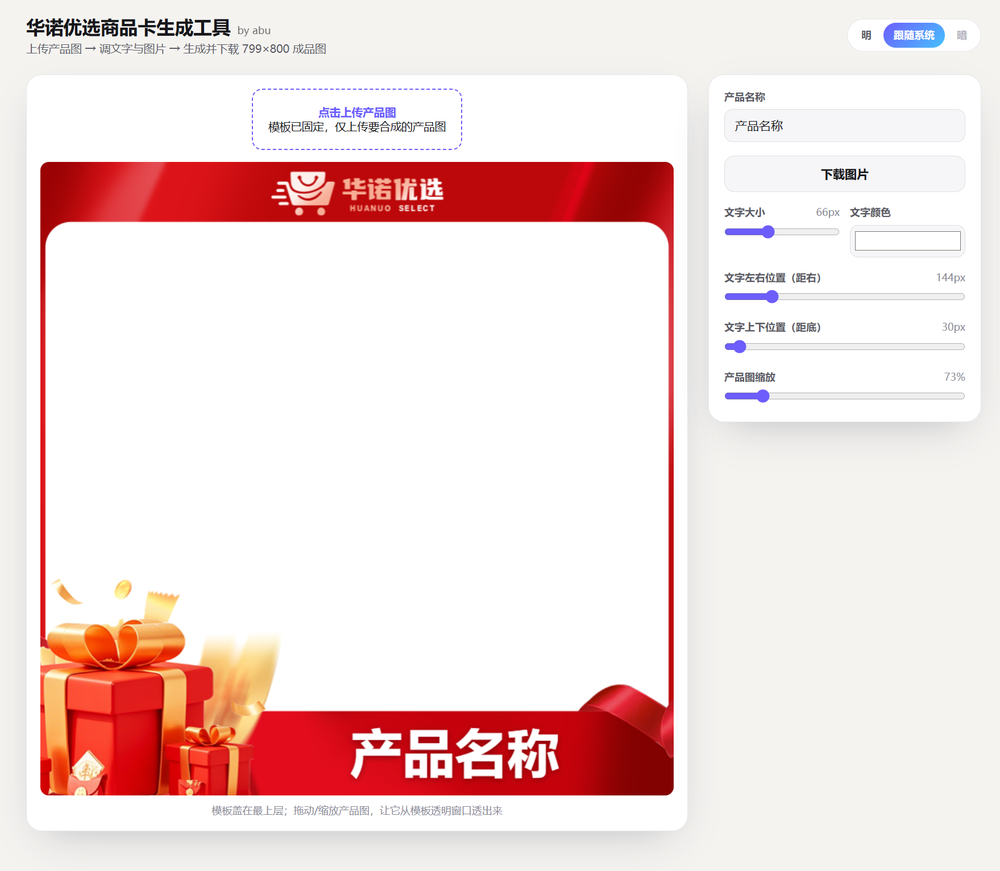

# 商品卡制作 · Product Image Border Tool

商品图边框批量处理工具（`JLJD-SKU.html`），为商品 SKU 图添加统一边框，支持 GitHub Actions 自动化。

## 文件说明
- `JLJD-SKU.html` — 主程序（单文件，浏览器打开即用）
- `.github/workflows/` — GitHub Actions 自动化工作流

## 使用
浏览器打开 `JLJD-SKU.html`，选择商品图片即可批量处理。

